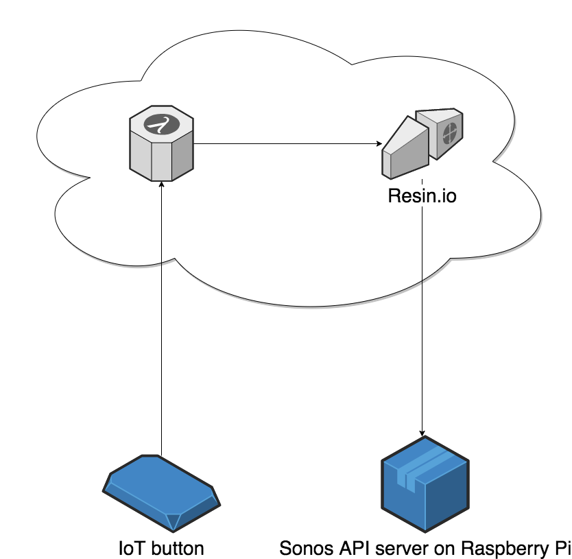

Lambda function which toggles the play/pause state of a Sonos system.

For instructions, see: https://www.david-merrick.com/2017/05/16/using-an-aws-iot-button-to-control-sonos-speakers/

## How it works 

The AWS IoT button triggers a Lambda function, which talks to a [Sonos API server](https://github.com/davidmerrick/rpi-node-sonos-http-api)
running on a Raspberry Pi. This server is deployed with [Resin.io](https://resin.io/) so that I could give it a public web address
without having to deal with NAT traversal/port forwarding.
